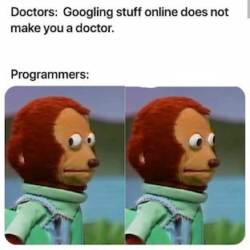

Natural Language Processing
============
The course addresses how we can approach theoretical and applied topics in human cognition using computational linguistics and natural language processing tools. The course also addresses key ethical topics that arise from the analysis of freely available natural language data, and in the development of natural language processing software and technologies. 
This course builds on students’ background knowledge in statistics and statistical programming, and introduces students to working with large data sets. The course builds towards the data science course. The course introduces students to ethical and philosophical topics, which will be extended on in the data science course. The course prepares students for careers involving analysis of text and other forms of natural language data, and for careers involving development of natural language software. 
   
See the [course catalog](https://kursuskatalog.au.dk/en/course/94415/Natural-language-processing) for more information. 

Schedule 
---------------------

[Regex: Videos 1_1 - 1_4](https://www.youtube.com/playlist?list=PLaZQkZp6WhWy4_bClrW9EGQKnUUD9yp8V)

[Minimum edit distance 2_1-2_5](https://www.youtube.com/playlist?list=PLaZQkZp6WhWy4_bClrW9EGQKnUUD9yp8V)

[Language modeling 3_1-3_8](https://www.youtube.com/watch?v=hM49MPmakNI&list=PLaZQkZp6WhWwJllbfwOD9cbIHXmdkOICY)

[Naive Bayes 5_1-5_9](https://www.youtube.com/watch?v=Y1j_J53k7fo&list=PLaZQkZp6WhWxU3kA6wV0nb5dY1SXDEKWH)

[Sentiment analysis 6_1-6_5](https://www.youtube.com/watch?v=Y1j_J53k7fo&list=PLaZQkZp6WhWxU3kA6wV0nb5dY1SXDEKWH)

[Information retrieval 7_1-7_6](https://www.youtube.com/watch?v=kNkCfaH2rxc&list=PLaZQkZp6WhWwoDuD6pQCmgVyDbUWl_ZUi)

[Information retrieval 7_1-7_6](https://www.youtube.com/watch?v=kNkCfaH2rxc&list=PLaZQkZp6WhWwoDuD6pQCmgVyDbUWl_ZUi)

[Information extraction and NER 9_1-10-5](https://www.youtube.com/watch?v=5SUzf6252_0&list=PLaZQkZp6WhWyszpcteV4LFgJ8lQJ5WIxK) 

[Vector semantics 13_8-13_10](https://www.youtube.com/watch?v=5SUzf6252_0&list=PLaZQkZp6WhWyszpcteV4LFgJ8lQJ5WIxK)

| Week | Date  | Lecture (Weds)                  | Class (Thurs)                       | HW Due (Weds)      | [Self-paced](https://github.com/leriomaggio/python-in-a-notebook)                       | [Readings](https://web.stanford.edu/~jurafsky/slp3/)       |
|------|-------|---------------------------------|-------------------------------------|--------------------|----------------------------------|----------------|
| 37   | 11/9  | Introduction/Text processing    | Regex, normalization | Computer set-up    | 00-03 (basic objects)            | J+M2           |
| 38   | 18/9  | Language modeling               | Ngrams                              |                    | 04-05 (if, while, for loops)     | J+M3           |
| 39   | 25/9  | Text classification             | Naive Bayes                         |                    | 06-07 (dictionaries, functions)  | J+M4           |
| 40   | 2/10  | Linguistic alignment            |                                     |                    | 08 (classes, OOP)                | TBA (Riccardo) |
| 41   | 9/10  | Sentiment analysis              | Logistic regressions, lexicons      |                    | CYOA (Choose your own adventure) | J+M5           |
| 42   | 16/10 | NO LECTURE                      | NO CLASS                            |                    | CYOA                             |                |
| 43   | 23/10 | TBD [Neuroimaging project week] |                                     | Project pitch week |                                  |                |
| 44   | 30/10 | Topic modeling                  | LDA                                 |                    |                                  | TBA (Luca)     |
| 45   | 6/11  | Vector semantics                | Word2Vec, SVMs                      |                    |                                  | J+M6           |
| 46   | 13/11 | Neural networks                 | TensorFlow                          |                    |                                  | J+M23          |
| 47   | 20/11 | Dialogue/Question answering     | DialogFlow                          |                    |                                  | J+M24          |
| 48   | 27/11 | NLP in research                 |                                     |                    |                                  |                |
| 49   | 4/12  | NLP in industry                 |                                     |                    |                                  |                |
| 50   | 11/12 | NLU and AI                      |                                     |                    |                                  | J+M15          |

Assignments
------------------

Use Github classroom to upload your assignments. 

Readings and resources 
---------------------

**Textbook chapters for Weds lectures**
[Speech and Language Processing](https://web.stanford.edu/~jurafsky/slp3/) (3rd ed. draft) by Dan Jurafsky and James H. Martin. 

**Supplementary Python textbook for Thurs classroom session**: 
[Natural Language Processing with Python](https://www.nltk.org/book/) by Steven Bird, Ewan Klein, and Edward Loper. 

### Jupyter notebooks

**For classroom group exercises**:
[The hands-on NLTK tutorial for NLP in Python](https://github.com/hb20007/hands-on-nltk-tutorial) 

**For self-paced Python learning**:
[leriomaggio's Collection of Jupyter Notebooks about Python programming](https://github.com/leriomaggio/python-in-a-notebook)

### More resources 

**CS 124 videos - YouTube** 

**3Blue1Brown - YouTube**

Course details
---------------

Lecturer: Rebekah Baglini
Instructor: Arnault V-Q 

On programming 
---------------

The NLP class will be a combination of theory and practice, including lots of hands-on implementation in Python. We will be starting off very gently, but it is important to note that this is *not* an introduction to Python programming class - i.e. you will not be formally instructed on matters like "what makes Python an object-oriented programming language?" and "when should one use a list versus a tuple?", nor will you be penalized for inelegant coding solutions. If the code accomplishes what it's supposed to, that's what matters. 

### Basic elements of Python 

In order to complete the classroom group work and coding assignments, it will help to have a basic understanding of the following: 
- variables and variable assignment
- strings, numbers (intergers and floats), basic arithmetic operations
- lists, sets, tuples, dictionaries 
- simple input and output
- conditional (if) statements
- while and for loops 
- functions and classes 

By "basic understanding" I mean that you have a grasp of what these different elements do and how they differ from one another. (See also **What does is mean to learn programming?** below.) 

Although can certainly learn these 'as-you-go' during the class, I highly recommend preparing doing a few hours of Python self-paced study in advance. Below is a list of five small programming tasks to help you assess your level of Python proficiency. 

---
**Self-assessment test for Python programming readiness:** 

> **_Task 1:_**
sfsdsdf

> **_Task 1: Adding machine_**
Write a function that adds two numbers x,y and returns the output x + y. Sample input might be x=-1, y=8 in which case the expected output is 7. The expected output is either float or int.

**Task 2: Character count**
Write a function that takes two arguments
- *s* an arbitrary string.
- *l* a letter (i.e. any valid single character).
The function should search the string for occurences of the letter and return an integer indicating how many times the letter *l* occurs in the string *s*.
- Note: Your function should be case-insensitive, i.e. it shouldn't care if the letter is "H" or "h"

**Task 3: Function *isEven***
Write a function which evaluates if a given integer number (given as a parameter for the function) is an even number. The function should return a Boolean value True if the number is even and False if the number is odd.
Given a list (or array) of *n* integer numbers, write a program which uses the function *isEven* to determines the number of even items in the list.

**Task 4: Search in List**
Given a list (or array) of *n* floating-point numbers, write a program which searches and outputs the largest number in the list.

**Task 5: String and Loops**
Write a function which takes a string (word) as an argument. The function should print the complete word on the first line and remove the last character on each successive line, ending with a single (the first) character. 
Example: Input word is Test
Function output:
Test
Tes
Te

**Task 6: Get dict keys** 
Write a function that takes as it's single input any dictionary
The function should return the keys of the input dictionary, in a list.

---

### Ok. I need to learn some things. Where should I start? 
If you're starting from 0, that's okay! Just spend a bit of time on self-paced study. There are a dizzying array of Python study options online, including many you can do from your web browser (Coursera, LearnPython.org, DataCamp). If you go ahead and set up your computer for the class, I highly recommend following this course: 

[Python in a notebook](https://github.com/leriomaggio/python-in-a-notebook) 
This course will also familiarizing you with Jupyter notebooks, which we will be using a lot this semester. 

### What does it mean to learn programming? 

Perhaps you are thinking: *I'll never be able to just sit down and code up whole programs from scratch!* 

And you would be right! Because nobody does (despite what you see in the movies). 

When you have a questions or encounter a snag, your best bet is Google. There's an 80% chance someone has already asked the same question on StackExchange. 

Module 1: Introduction and basic text processing 
---------------------

